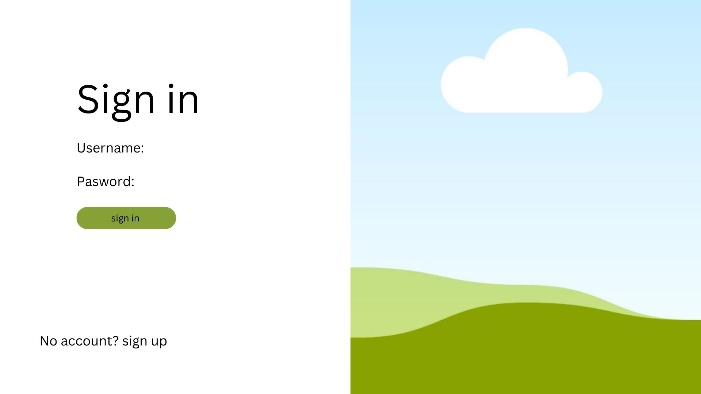
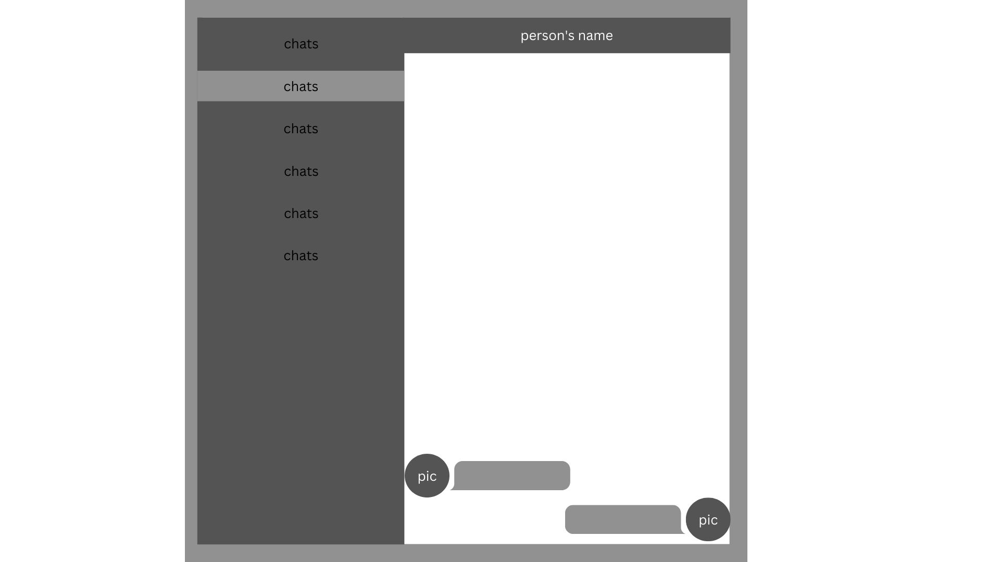
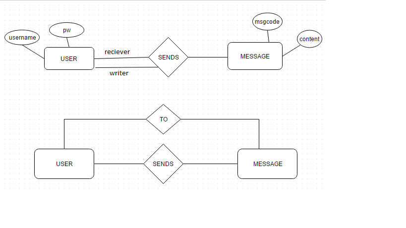

# Mesgus
## project description
Mesgus is a messagin app where people can create their own account and be able to start a conversation with other people in real time.

# Wireframes

User can navigate thru the sign in page and see the sign in button to log in into account or sign up button to create one.

The user can click on the chats and see the conversation or start a new one.
# MVP User Stories
As a user, I want to see and create chats for me or the people whose interested in talking with me.
As a user, I want to select the person that I want to chat with and if there is not past conversation I can be able to start a chat.
As a user, I want to be able to easily navigate the different chats I have stored in my account.

## Post MVP Stretch Goals
As a user, I would like to be able to search for people by name so that I can more easily find a person and view its details.
As a user, I would like to be able to filter my searches, so that I can more easily select the person I want to chat with.

# ERD's

# Site deployment

[Click this link :)](https://mesgus.netlify.app/)